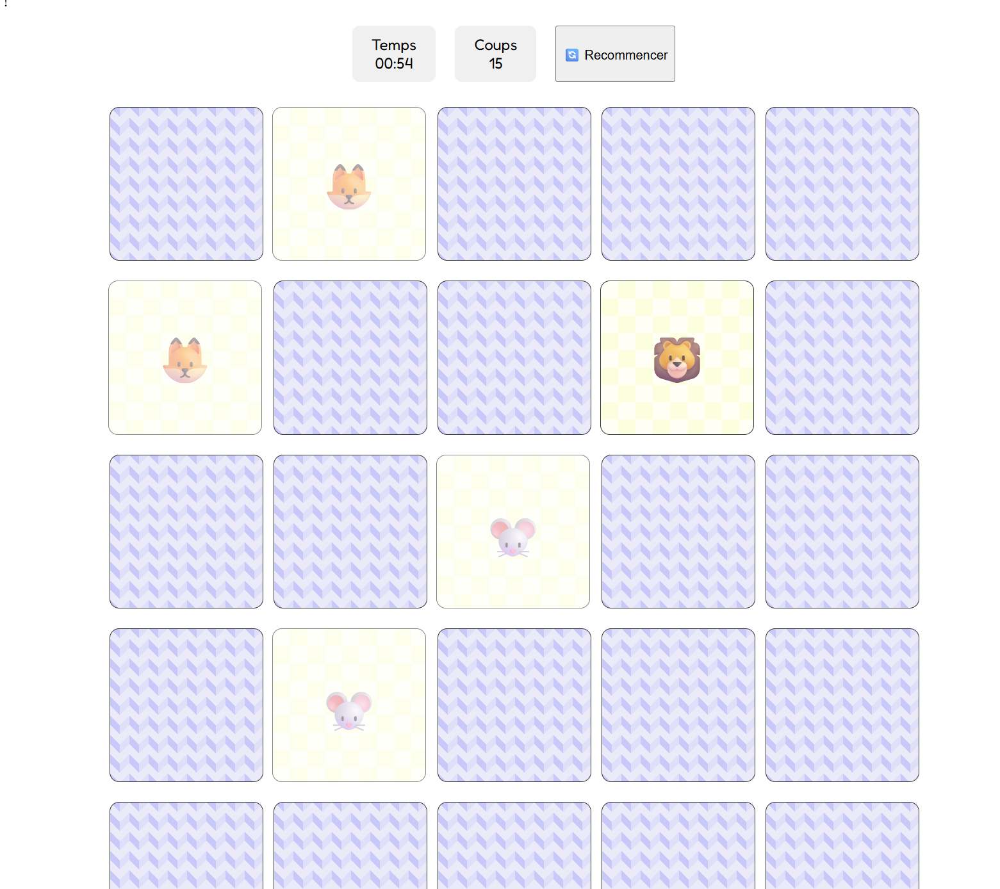
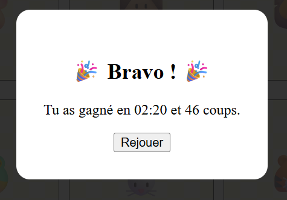

# 🧠 Jeu de Mémo (Memory Game)

Un petit jeu de mémoire classique développé pour s'entraîner aux interactions DOM et à la logique algorithmique. Le but est simple : retrouver toutes les paires d'émojis le plus vite possible !

## 🚀 Fonctionnalités actuelles

* **Génération dynamique (PHP) :** La grille de jeu est construite côté serveur via des boucles PHP, permettant de changer la taille du jeu facilement.
* **Contenu aléatoire (JS) :** Injection et mélange d'émojis via JavaScript au chargement.
* **Statistiques en temps réel :** Compteur de temps (chronomètre) et compteur de coups joués.
* **Interface utilisateur :**

  * Animations de retournement de cartes (Flip 3D CSS).

  * Modale de victoire ("Pop-up") affichant le score final.
* **Responsive :** La grille s'adapte aux écrans.

## 🛠️ Stack Technique

Ce projet utilise une stack web native sans framework lourd :

* **HTML5 :** Structure sémantique.
* **CSS3 :** Utilisation de variables, Flexbox et `transform` pour les effets 3D.
* **JavaScript (Vanilla) :** Logique du jeu (Mélange, distribution, vérification des paires, timer).
* **PHP :** Génération du markup HTML de la grille (boucles `for`).

## 📦 Installation et Lancement

Puisque ce projet utilise du **PHP** pour générer la grille, il nécessite un serveur local.

## 📸 Aperçu

## 🔜 Améliorations futures (To-Do)

* [ ] **Sauvegarde des scores :** Connecter une base de données MySQL pour enregistrer les meilleurs temps (Leaderboard).
* [ ] **Niveaux de difficulté :** Créer un menu pour choisir la taille de la grille (Modifier les variables PHP `$game_width` / `$game_height`).
* [ ] **Audio :** Ajouter des bruitages pour les paires trouvées et la victoire.

---

**Fait avec ❤️✨🐛 par Arthur Schmitt et Selim Sutcu*
